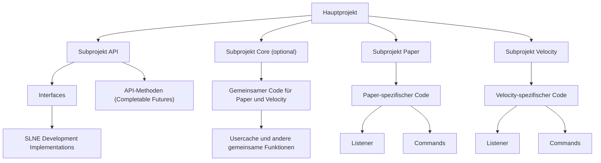

# Projektstruktur

> Externe Entwickler*innen dürfen **keine neuen Projekte oder Gruppen erstellen**. Bevor du mit der Entwicklung
> beginnst, müssen Ideen für neue Projekte mit den Admins abgesprochen werden.
>
{style="note"}

Jedes Projekt wird nach folgender Struktur aufgebaut:

1. **Hauptprojekt** erstellen.
2. **Subprojekt API** erstellen:
    - Das API-Subprojekt sollte hauptsächlich aus Interfaces bestehen, die von der SLNE Development Gruppe implementiert
      werden.
    - Alle API-Methoden müssen als **Completable Futures** umgesetzt werden.
3. **Subprojekt Core** erstellen (optional):
    - Das Core-Subprojekt enthält gemeinsamen Code für Paper und Velocity.
    - Gemeinsame Funktionen, wie z. B. ein Usercache, sollten hier initialisiert werden, um doppelten Code zu vermeiden.
4. **Subprojekt Paper / Velocity** erstellen:
    - Paper und Velocity enthalten jeweils den spezifischen Code, z. B. Listener, Commands etc.

